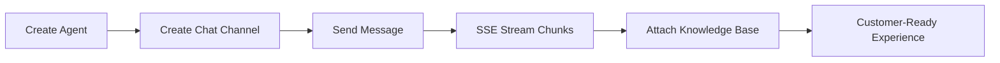

# AI Sandbox SDK for Java


## UX-First Value Cards

| Quick Integration | Real-Time Experience | Reliability by Default |
| --- | --- | --- |
| Clean Java API surface with low onboarding overhead | `sendChatStream(...)` for streaming chunks | Timeout + retry controls tuned for production |

## Visual Integration Flow



## 60-Second Quick Start

```java
import com.egroupai.sandbox.sdk.AiSandboxClient;
import java.util.List;
import java.util.Map;

AiSandboxClient client = new AiSandboxClient(
  System.getenv().getOrDefault("AI_SANDBOX_BASE_URL", "https://www.egroupai.com"),
  System.getenv().getOrDefault("AI_SANDBOX_API_KEY", "")
);

Map<String, Object> agent = client.createAgent(Map.of(
  "agentDisplayName", "Support Agent",
  "agentDescription", "Handles customer inquiries"
));
int agentId = Integer.parseInt(String.valueOf(((Map<String, Object>) agent.get("payload")).get("agentId")));

Map<String, Object> channel = client.createChatChannel(agentId, Map.of(
  "title", "Web Chat",
  "visitorId", "visitor-001"
));
String channelId = String.valueOf(((Map<String, Object>) channel.get("payload")).get("channelId"));

List<String> chunks = client.sendChatStream(agentId, Map.of(
  "channelId", channelId,
  "message", "What is the return policy?",
  "stream", true
));
chunks.forEach(System.out::println);
```

## Maven

```xml
<dependency>
  <groupId>com.egroupai</groupId>
  <artifactId>ai-sandbox-sdk-java</artifactId>
  <version>1.0.0</version>
</dependency>
```

## Snapshot

| Metric | Value |
| --- | --- |
| API Coverage | 11 operations (Agent / Chat / Knowledge Base) |
| Stream Mode | `text/event-stream` with `[DONE]` handling |
| Error Surface | `ApiException` with status/body |
| Validation | Production-host integration verified |

## Links

- [Official System Integration Docs](https://www.egroupai.com/ai-sandbox/system-integration)
- [30-Day Optimization Plan](docs/30D_OPTIMIZATION_PLAN.md)
- [Integration Guide](docs/INTEGRATION.md)
- [Quickstart Example](src/main/java/com/egroupai/sandbox/sdk/examples/Quickstart.java)
- [Repository](https://github.com/eGroupAI/ai-sandbox-sdk-java)
